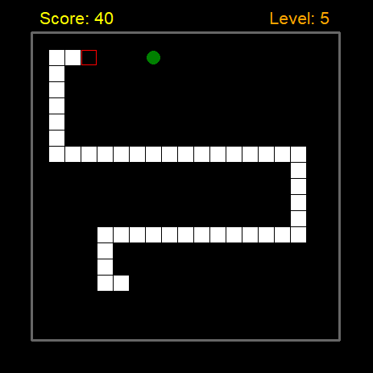

# Snake by Mils3x3

A modular Python Snake game built with **Python Turtle**, **Tkinter**, and **Pygame**.

This project started as a classic Snake game and was expanded into a more complete portfolio project with level progression, collision detection, replay support, animated visual elements, synchronized looping music, fade-in audio layers, and dynamic bite sound effects based on the current position of the music loop.

---

## Project Overview

**Snake by Mils3x3** is a custom Snake game written in Python. The game uses Python Turtle for the main graphics, Tkinter for the start and replay windows, and Pygame for music and sound effects.

The main goal of this project was to practise and demonstrate:

- modular Python project structure
- object-oriented game elements
- keyboard control handling
- collision detection
- score and level management
- audio playback with Pygame
- synchronised looping music layers
- dynamic sound effects linked to gameplay timing
- preparing a Python game for portfolio and executable release

---

## Features

- Classic Snake gameplay built with Python Turtle
- Modular code structure split across multiple Python files
- Start window and replay window using Tkinter
- Score display and level display
- Animated countdown before the game starts
- Animated border drawing
- Keyboard control with queued direction changes
- Border collision detection
- Self-collision detection
- Random apple placement with checks to avoid the snake body and head
- Increasing speed as the player reaches higher levels
- Pygame-based sound and music system
- Multiple background music tracks running in synchronised loops
- Fade-in music layers as the player reaches new levels
- Different apple bite sounds depending on the current music loop position
- Random game-over sounds
- Replay support after game over
- Resource path handling for normal Python runs and PyInstaller builds

---

## Controls

| Key | Action |
| --- | --- |
| Up Arrow | Move up |
| Down Arrow | Move down |
| Left Arrow | Move left |
| Right Arrow | Move right |

---

## Project Structure

```text
snake-by-mils3x3/
│
├── README.md
├── COPYRIGHT.md
├── requirements.txt
├── .gitignore
│
├── main.py
├── apple.py
├── border.py
├── control.py
├── countdown.py
├── level.py
├── score.py
├── settings.py
├── snake.py
├── sound.py
├── window.py
│
├── icon.ico
│
├── sounds/
│   ├── track1.ogg
│   ├── track2.ogg
│   ├── ...
│   ├── track10.ogg
│   ├── small_bite1.ogg
│   ├── small_bite2.ogg
│   ├── small_bite3.ogg
│   ├── big_bite1.ogg
│   ├── big_bite2.ogg
│   ├── big_bite3.ogg
│   ├── end1.ogg
│   ├── end2.ogg
│   └── ...
│
└── screenshots/
    └── snake-game.png
```

---

## Main Files

| File | Purpose |
| --- | --- |
| `main.py` | Main game loop, gameplay flow, collision checks, scoring, levels, replay logic |
| `snake.py` | Snake body creation and new segment handling |
| `apple.py` | Random apple placement |
| `control.py` | Keyboard direction control and queued turn logic |
| `score.py` | Score display |
| `level.py` | Level display and level flash effect |
| `countdown.py` | Animated countdown before the game starts |
| `border.py` | Animated border drawing |
| `sound.py` | Music loading, sound effects, fade-in logic, game-over audio, resource paths |
| `window.py` | Tkinter start and replay windows |
| `settings.py` | Basic game settings such as board size, movement distance, and speed multiplier |

---

## Requirements

- Python 3.11+
- Pygame

Python Turtle and Tkinter are included with the standard Python installation on most systems.

Install the external dependency:

```bash
pip install -r requirements.txt
```

Example `requirements.txt`:

```txt
pygame
```

---

## How to Run

Clone the repository:

```bash
git clone https://github.com/YOUR-USERNAME/snake-by-mils3x3.git
cd snake-by-mils3x3
```

Install requirements:

```bash
pip install -r requirements.txt
```

Run the game:

```bash
python main.py
```

---

## Windows Executable

A Windows executable version may be provided under the **GitHub Releases** section.

The executable was built from the Python source code using PyInstaller.

> Note: The Windows executable is not digitally signed. Windows SmartScreen or antivirus software may show a warning for unsigned Python executables, even when the file is safe.

---

## Audio System

The project uses Pygame Mixer for music and sound effects.

The background music system starts multiple looped music tracks at the same time and keeps them synchronised. Most tracks start with volume set to zero, then fade in when the player reaches specific score ranges and levels.

The apple bite sound system checks the current position of the music loop and selects a different bite sound depending on where the music is within the loop. This creates a more rhythmic and dynamic sound effect system instead of playing the same sound every time.

---

## Audio and Assets

The music tracks and apple bite sound effects were created by **Milan Olah** for this project.

The game-over sounds use meme-style audio sourced from YouTube and are treated as third-party audio. They are included only as part of this personal portfolio/demo project and are not claimed as original work.

Audio and media assets included in this repository are not licensed for reuse, redistribution, modification, or commercial use without permission from the relevant rights holders.

---

## Screenshots

Add a screenshot to the `screenshots/` folder and update the image path below if needed:

```md

```

---

## Project Status

This project is considered complete as a portfolio version.

Possible future improvements:

- replacing third-party meme sounds with fully original game-over sounds
- adding a menu for difficulty selection
- adding high-score saving
- adding a pause option
- refactoring the game into a dedicated `Game` class
- creating a more advanced installer for Windows

---

## Author

**Milan Olah**  
GitHub: `@mils3x3`

---

## Copyright

Copyright © 2026 Milan Olah. All rights reserved.

This repository is provided as a personal portfolio project. The source code may be viewed for educational and portfolio review purposes. Audio and media assets are not licensed for reuse unless explicitly stated.
